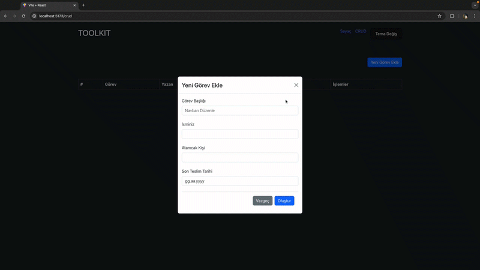

Redux Toolkit ile CRUD Projesi

Redux Toolkit kullanılarak yapılmış basit bir CRUD (Create, Read, Update, Delete) uygulaması.

Başlarken

Gereksinimler
Node.js ve npm (veya yarn) kurulu olmalı.
Kurulum
Depoyu klonlayın:

git clone https://github.com/kullaniciadi/crud-redux-toolkit.git
Proje dizinine gidin:

Kodu kopyala
cd crud-redux-toolkit
Bağımlılıkları yükleyin:

npm install
veya

yarn install
Kullanım
Geliştirme sunucusunu başlatın:

npm start
veya

yarn start
Proje Yapısı

css

src/
├── app/
│   └── store.js
├── features/
│   └── entities/
│       ├── entitySlice.js
│       └── EntityComponent.js
├── components/
├── App.js
├── index.js
Özellikler

Ekle: Yeni öğeler ekleyin.
Oku: Öğeleri listeleyin.
Güncelle: Öğeleri düzenleyin.
Sil: Öğeleri kaldırın.
Teknolojiler

React
Redux Toolkit
JavaScript (ES6+)

# Gif
 
